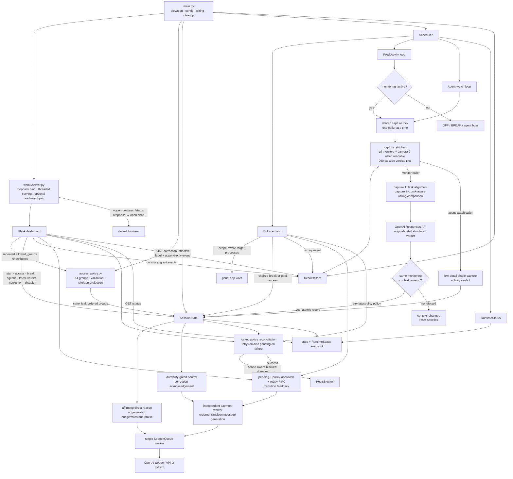

# Deep Work: Windows Productivity Enforcement

Deep Work is a personal Windows 11 focus app. During a focused session it
blocks configured website domains through the Windows hosts file, terminates
named distraction apps, periodically captures every monitor plus camera index
`0` when readable, asks an OpenAI vision model for a structured productivity
verdict, and speaks feedback. A local Flask dashboard controls the session,
shows current state and scheduler health, and lets the user correct the newest
productivity verdict without discarding the model's original judgment.


This is an enforcement aid, not a security boundary. The blocklist is explicit,
the AI can be wrong, and anyone with administrator access can undo the policy.

## Implemented behavior

1. **Website blocking**
   - The configured groups are Reddit, YouTube, Twitter/X, Discord, Hacker
     News, LinkedIn, Bluesky, Substack, Facebook, LessWrong, EA Forum, and
     4chan.
   - `deepwork/config.py` defines and expands the explicit hostname and process
     tables; `deepwork/access_policy.py` owns the ordered 14-option catalog,
     validation, labels, capabilities, and site/app projection. There is no
     wildcard matching.
   - `HostsBlocker` writes both `127.0.0.1` and `::1` entries inside a
     marker-fenced `# >>> deepwork block start` section, then runs
     [`ipconfig /flushdns`](https://learn.microsoft.com/en-us/windows-server/administration/windows-commands/ipconfig).
   - Session, temporary-access, break, and agent transitions mark a new desired
     policy. One locked reconciliation writes the newest policy immediately;
     if that write fails, `/status.enforcement.reconciliation_pending` remains
     true and the enforcer retries it on a later tick without letting an older
     write overwrite newer state. `/disable` requests fenced-section removal,
     and normal interpreter shutdown attempts the same serialized removal.

2. **Distraction-app termination**
   - While mode is ON or BREAK, the enforcer checks every
     `KILL_INTERVAL_S` seconds and kills exact, case-insensitive process-name
     matches for Discord, Telegram, and Steam. It calls `proc.kill()` on every
     matching process; it does not verify executable path or owner and does not
     request graceful application shutdown.
   - Task, temporary-goal, and break access use the same canonical groups as
     website policy. A selected app-capable group spares its exact processes
     while that scope is active. Discord is one dual-capability choice that
     opens its configured websites and spares `discord.exe`; Telegram and Steam
     are app-only choices. Agentic waiting adds no app exceptions.

3. **Rolling progress evaluation**
   - On each active monitor tick, `mss` captures every physical monitor.
     OpenCV also attempts DirectShow camera index `0`; an unsuccessful read
     simply omits the webcam tile, while a capture/conversion exception fails
     that scheduler tick without stopping later ticks. There is currently no
     camera-disable or camera-index setting.
   - Every monitor/webcam tile is resized to 960 pixels wide while preserving
     aspect ratio, labeled, stacked vertically, and saved as a timestamped JPEG
     at quality 80.
   - Productivity images are sent with `detail="original"`. With the default
     GPT-5.6 Luna model, this preserves the dimensions of that already-resized,
     compressed composite—not the monitors' native pixels. The agent watcher
     remains a separate low-detail workload.
   - A successful capture triggers one Responses API evaluation over the newest
     one through `PROGRESS_WINDOW_CAPTURES` stitched captures, oldest first,
     provided its versioned monitoring context still matches. A transition
     during capture discards it before model work.
   - The first capture judges only current task alignment and engagement; it
     cannot establish progress or a stall. From the second capture onward, the
     model compares corresponding monitor and webcam panels across the whole
     available oldest-to-newest window. `PROGRESS_WINDOW_CAPTURES` is the
     maximum retained history, not a prerequisite for comparison.
   - A capture enters the rolling deque before its API call completes. If model
     analysis or exchange persistence fails, the saved capture remains, so a
     later successful request can compare multiple images even when no earlier
     verdict was recorded.
   - The comparison is task-aware. Coding, writing, editing, note-taking,
     debugging, and active research normally need meaningful task-relevant
     changes; an unchanged scene with no other aligned evidence can be judged
     stalled from capture two. Reading, thinking, calls, physical work, and
     visibly running builds, tests, or training may remain productive only when
     concrete topic-aligned evidence supports genuine engagement; vague tasks do
     not justify an invented static-work exception. Timestamps, clocks, cursors,
     animations, webcam lighting, minor posture changes, and unrelated visible
     changes do not establish progress.
   - Learning, research, and problem-solving may move from a primary source to a
     clearly topic-relevant clarification resource, including an explanatory
     video, lecture, article, documentation page, reference, worked example, or
     forum explanation. The resource may become the primary visible activity;
     the original book or work need not remain onscreen. It counts as productive
     only when concrete visible content connects it to the topic and the capture
     evidence coherently supports task-directed engagement. When those conditions
     hold, it can establish current or sustained focus without a visible artifact,
     but playback, scrolling, navigation, and source switching alone do not prove
     conceptual progress. Progress claims still require chronological evidence
     such as synthesis, notes, or application. Governed website/app groups must
     remain explicitly allowed, temporary-goal activity
     must serve both the topic and goal, and unrelated media or recommendation
     drift remains off-track.
   - Mathematics worked out on a tablet is a supported static-work case. A
     visibly recognizable unsolved exercise, equation, or problem statement can
     corroborate a concrete math topic even while it stays unchanged onscreen,
     but only alongside webcam evidence of stylus use, handwriting, or a
     task-directed calculation posture. The tablet surface and fresh handwriting
     need not appear in every snapshot, and brief thinking pauses may occur while
     the combined evidence remains coherent. That combination can establish
     sustained focus across a long interval; it does not establish solution
     progress unless chronological evidence shows advancement. The exercise,
     device or stylus presence, looking down, or posture changes without
     task-directed engagement are insufficient, and clear unrelated browsing,
     media, chat, or gaming remains off-track.
   - A music video may occupy only a secondary part of a monitor as neutral,
     work-supporting background media. It does not establish productivity:
     capture one still requires genuine task-aligned engagement, and from
     capture two onward the remaining work area must show meaningful
     task-relevant progress. Changing video frames, animation, playback bars,
     timestamps, titles, and other playback changes never count as progress. If
     the work stalls or the video becomes the primary activity, the ordinary
     video and access rules apply. This evaluator exception does not unblock a
     website or grant an access group.
   - With the defaults, comparison begins on the second retained same-context
     capture, while the fifth is the first maximum-length five-capture window.
     Its nominal oldest-to-newest span is at least about 20 minutes and the
     fifth tick completes at least about 25 minutes after an uninterrupted loop
     begins; capture and API latency extend both timings.

4. **Spoken feedback**
   - Starting a session generates and queues an LLM-written good-luck message.
     Starting or manually stopping a break queues a context-grounded
     acknowledgment. All ready transition jobs share one FIFO
     message-generation worker and then the global FIFO speech queue. A
     goal-access acknowledgment held back by failed enforcement or an undurable
     earlier event is not ready, so a later independent session or break
     acknowledgment can be delivered first.
   - Starting temporary goal access, stopping it manually, or an enforcer tick
     detecting expiry immediately attempts the complete lifecycle event and
     retains a failed JSONL line in memory for retry. It requests one
     context-grounded acknowledgment only after the relevant event is durable
     and hosts reconciliation succeeds. Requests are bound to policy revisions:
     a successful reconciliation approves messages that its applied policy
     makes true, while a failed permission transition superseded by a newer
     policy is dropped rather than announced. Approved requests reach the
     separate transition worker, so model/TTS latency cannot hold the policy
     lifecycle lock or delay expiry. Model/TTS failure is logged without
     rolling state back or retrying the utterance. If opening enforcement never
     succeeds before the grant ends, its now-stale start acknowledgment is
     cancelled.
   - An accepted productivity verdict is recorded before its JSONL event and
     any optional nudge/praise generation. If those downstream steps succeed,
     the tick queues exactly one utterance; a storage or message-generation
     failure can therefore leave the in-memory verdict unsaid.
     An ordinary productive verdict speaks the vision model's reason directly;
     that reason is prompted to integrate a brief, naturally varied affirmation
     tied to the observed work before naming its concrete evidence. A
     single-capture reason may praise current engagement but cannot claim
     progress over time. From the second capture onward, progress praise
     requires task-relevant chronological evidence; when only engagement is
     supported, the model praises the engagement or focus instead. An off-track
     verdict or 30-minute streak milestone first uses the text model to generate
     a context-grounded nudge or richer praise.
   - Correcting the newest verdict queues one neutral, AI-written confirmation
     only after its append-only audit event is durable. It does not rerun the
     analyzer or reinterpret the capture. A correction accepted while the
     original feedback is still being generated suppresses that stale original
     utterance before speech.
   - At the default cadence, each productive verdict credits five streak
     minutes. Six consecutive productive verdicts trigger praise and reset the
     streak counter. A latest-verdict correction re-folds that credited interval
     when its streak segment is still current. This is configured-interval
     accounting, not measured foreground activity time.
   - OFF, BREAK, and agent-busy states pause new periodic evaluations. They do
     not cancel speech that was already queued.
   - `TTS_ENGINE=openai` uses the Speech API; `TTS_ENGINE=pyttsx3` changes only
     playback to offline Windows speech. Vision and message generation still
     require OpenAI. The dashboard discloses that OpenAI speech is
     AI-generated, as required by the
     [OpenAI TTS guide](https://developers.openai.com/api/docs/guides/text-to-speech).

5. **ON, OFF, and BREAK modes**
   - **ON:** desired website blocking, app termination, and productivity
     monitoring are active. `/status` identifies any pending hosts
     reconciliation.
   - **OFF:** entering this mode through `/disable` requests removal of the
     hosts section, and monitor/app enforcement ticks do no work. A failed
     removal remains pending for a later enforcer retry.
   - **BREAK:** monitoring pauses until the timed break expires or the user
     selects **Stop break and resume work**. Task-required access groups remain
     active, and the break can add website/app groups that last only for that
     break.
   - A positive social-media break submitted through the provided form reserves
     its requested minutes immediately against the local-date daily allowance
     (120 minutes by default). A positive request beyond the remaining
     allowance is refused. Manually stopping refunds unelapsed reserved minutes
     and charges every started minute, rounded up and capped at the requested
     duration. Natural expiry keeps the full reservation. Away breaks do not
     spend that allowance.
   - Accounting currently trusts the submitted `kind` alone: exactly
     `social_media` is charged, regardless of selected groups, while any other
     kind is uncharged. The server does not infer social use from the selected
     groups, so a forged `away` request can open Reddit or another group without
     using the allowance. See **Known limitations** before relying on the cap.
   - Turning enforcement off requires the exact, case-sensitive phrase:
     `I will not stop cool deepwork session`.

6. **Task-scoped website and app access**
   - The Start form accepts checked access groups and an optional
     `projects.json` preset. Their ordered, deduplicated union remains permitted
     during ON and BREAK for that focused session.
   - Website-capable groups open their configured domains; app-capable groups
     spare their configured processes. Discord does both from one checkbox.
   - These permissions remain part of monitored task context, do not spend
     social-break minutes, and reset when another session starts. Task and
     preset keys are strictly validated before state or enforcement changes.

7. **Repeatable temporary goal access**
   - During an ON session, the dashboard can permit any configured website/app
     groups for a required subgoal. One grant may be active at a time, but
     manual completion or enforcer-detected expiry permits another; there is no
     per-session count or cumulative-minute limit.
   - A grant lasts for 1–240 wall-clock minutes or until the current session
     ends. It leaves the session in ON mode, spends no social-break allowance,
     can spare selected apps, and does not itself pause productivity monitoring.
   - The analyzer receives the exact subgoal and temporary access groups.
     Allowed browsing, chat, video, or app activity is productive only when
     visible evidence serves both the session topic and the stated subgoal.
   - Every relevant state transition changes a versioned monitoring context.
     The next monitor tick resets its rolling window; if that context changes
     during capture, the image is discarded before persistence/model work. If
     it changes during storage or model analysis, the capture/exchange may
     already exist locally or have been uploaded, but the stale verdict, event,
     and speech are rejected and the following tick starts with the new context.
   - BREAK preserves the grant but suspends all of its website and app
     permissions while the timer continues. An unexpired grant resumes when the
     break ends; an expired grant does not. Suspension removes only the grant's
     permissions; task or break access can still permit an overlapping group,
     and agentic policy can still open overlapping websites.

8. **Agentic engineering mode**
   - An optional watcher uses the same stitched monitor/webcam capture path and
     a low-detail vision request every `AGENT_CHECK_INTERVAL_S` seconds.
   - When the latest verdict changes to "agent working," the **website**
     blocklist becomes empty and productivity monitoring pauses. The app killer
     continues.
   - When the watcher later observes an idle, finished, or input-waiting agent,
     normal website restrictions return while task-required and any active
     goal-access website groups remain open, and one transition message is
     spoken.
   - Detection occurs on scheduled polls, not instantly, and AI classification
     can be wrong. Agentic waiting does not spend social-break allowance.

9. **Local realtime dashboard**
   - Werkzeug's threaded development server hosts the Flask app only on
     `127.0.0.1` and defaults to port `5000` through `UI_PORT`.
   - With `--open-browser`, startup waits up to 30 seconds for `/status` to
     answer before requesting one default-browser tab. Plain terminal runs do
     not opt in, and `--smoke` starts neither the server nor browser worker.
   - Once loaded, the dashboard requests the no-cache `/status` JSON endpoint
     every three seconds, never overlaps polls, pauses polling in a hidden tab,
     and keeps the last good view during a temporary connection failure.
   - It displays session state, canonical permanent/temporary/break access,
     agent state, desired enforcement counts and reconciliation state,
     current-session verdict history, and the cadence/result/error state of all
     scheduler loops.
   - Only the latest verdict has a reversible productive/off-track correction.
     The effective label drives history totals and eligible streak accounting,
     while the original model label, explanation, and observation remain
     visible. See [`docs/verdict-corrections.md`](docs/verdict-corrections.md)
     for the complete UI, HTTP, accounting, audit, and privacy contract.

10. **Local artifacts and logs**
   - `results/captures/*.jpg`: stitched productivity and agent-watch captures.
   - `results/llm/*.json`: complete successful text/vision Responses API
     objects and textual prompts. Image request payloads refer to the separately
     stored JPEG paths instead of duplicating base64 data. TTS audio/responses
     and failed API calls are not stored here.
   - `results/sessions/*.jsonl`: serialized timestamped session events,
     including append-only source verdicts and manual verdict corrections;
     transient failed lines remain queued in memory for retry.
   - `results/state.json`: daily social usage and previous topics only; these
     are the only fields reloaded into live state after restart.
   - `logs/deepwork_*.log`: timestamped runtime logs, also streamed to the
     terminal.
   - There is no automatic retention or pruning. Captures, exchanges, session
     events, and logs accumulate, and current-session verdict history is
     unbounded until a new session or process restart.

## Architecture

`main.py` is the orchestration wrapper. It performs elevation, configuration
and logging, blocker selection, object wiring, cleanup registration, and run
mode selection. Server startup and domain behavior are in `deepwork/`.



The scheduler uses fixed-delay loops: each loop waits its configured interval,
runs the blocking tick, then waits again. Capture/API duration therefore adds
to the wall-clock time between tick starts, and session Start does not reset
the global loop countdown.

All state-changing routes and scheduler transitions publish hosts policy
through the same state-owned reconciliation lock. A failed backend call keeps
the latest desired policy dirty for a later enforcer retry; while it is
pending, the desired dashboard counts can differ from the hosts file.

The productivity and agent-watch loops share one capture lock because
[OpenCV documents `VideoCapture` as non-thread-safe](https://docs.opencv.org/master/d0/db6/tutorial_orbbec_astra_openni.html).
The lock covers only the injected screen/webcam capture call, so an overlapping
request waits for the active capture to finish; saving, model analysis, state
updates, and speech remain outside the lock.

## Requirements

- Windows 11. Hosts-file editing, UAC elevation, DirectShow camera capture, and
  `winsound` playback are Windows-specific.
- [uv](https://docs.astral.sh/uv/) and internet access. `.python-version`
  selects Python 3.13; uv creates the project-local `.venv`.
- An OpenAI API key with access to the configured text/image models and, when
  `TTS_ENGINE=openai`, the configured speech model.
- Administrator approval for real hosts-file enforcement.
- A camera and audio output are optional. An unsuccessful camera read is
  tolerated; camera exceptions fail only that capture tick, and speech failures
  are logged.

## Install

```powershell
git clone https://github.com/BurnyCoder/deep-work-jarvis-waifu-supervisor.git deep-work
cd deep-work
uv sync --locked
Copy-Item .env.example .env
# Edit .env and replace the placeholder OPENAI_API_KEY.
```

`uv sync --locked` reproduces the checked-in lockfile in `./.venv`; use plain
`uv sync` after intentionally changing dependencies. See the
[uv project guide](https://docs.astral.sh/uv/guides/projects/) for the
environment and lockfile behavior.

### Configuration

`.env` contains the runtime tunables:

| Variable | Default | Purpose |
|---|---:|---|
| `OPENAI_API_KEY` | none | Required API credential |
| `VISION_MODEL` | `gpt-5.6-luna` | Rolling productivity vision model; must support original image detail |
| `PROGRESS_REASONING_EFFORT` | `medium` | Productivity-model reasoning effort |
| `AGENT_VISION_MODEL` | `gpt-5.6-luna` | Frequent agent-activity vision model |
| `AGENT_REASONING_EFFORT` | `medium` | Agent-activity reasoning effort |
| `TEXT_MODEL` | `gpt-5.6-luna` | Good-luck/nudge/milestone-praise message model |
| `TEXT_REASONING_EFFORT` | `medium` | Feedback-message reasoning effort |
| `TTS_ENGINE` | `openai` | `openai` or `pyttsx3` playback |
| `TTS_MODEL` | `gpt-4o-mini-tts` | OpenAI speech model |
| `TTS_VOICE` | `coral` | OpenAI speech voice |
| `CAPTURE_INTERVAL_S` | `300` | Fixed delay before each productivity tick |
| `PROGRESS_WINDOW_CAPTURES` | `5` | Maximum rolling comparison history (minimum 2); comparison starts at capture 2 |
| `KILL_INTERVAL_S` | `3` | Fixed delay before each enforcement tick |
| `AGENT_CHECK_INTERVAL_S` | `60` | Fixed delay before each agent-watch tick |
| `DAILY_SOCIAL_CAP_MIN` | `120` | Daily social-break reservation cap |
| `UI_PORT` | `5000` | Loopback dashboard port |

`BATCH_SIZE` remains a compatibility fallback for
`PROGRESS_WINDOW_CAPTURES`. The hosts path, 14-group website/app catalog, and
disable phrase are code constants rather than `.env` settings.

Run from the repository root: optional `projects.json`, `logs/`, and `results/`
use relative paths and therefore follow the current working directory.
[python-dotenv](https://bbc2.github.io/python-dotenv/reference/) searches upward
from the calling source file for `.env`, which finds the repository-root file in
the normal checkout. Existing process environment variables take precedence
because `load_dotenv()` uses its default non-overriding behavior.

Configuration validation is intentionally sparse in the current code. Numeric
values are parsed with `int()`; nonnumeric values fail before file logging is
configured. Keep all three scheduler intervals positive,
`PROGRESS_WINDOW_CAPTURES` at least 2, `DAILY_SOCIAL_CAP_MIN` nonnegative, and
`UI_PORT` within the valid TCP port range. Only the progress-window minimum is
explicitly checked later; zero/negative loop intervals can create tight loops.
Only the exact value `TTS_ENGINE=openai` selects the OpenAI speaker—every other
value currently falls back to pyttsx3 rather than producing a validation error.

All Responses API text and vision calls default to
[GPT-5.6 Luna](https://developers.openai.com/api/docs/models/gpt-5.6-luna) with
`medium` reasoning. OpenAI documents
[`medium` as a balanced starting point](https://developers.openai.com/api/docs/guides/latest-model#update-api-and-model-parameters),
while higher efforts are intended for workloads with a measured quality gain.
Each workload therefore keeps separate `.env` overrides. Luna produces text
rather than speech, so TTS remains on the dedicated
[GPT-4o mini TTS](https://developers.openai.com/api/docs/models/gpt-4o-mini-tts).
`VISION_MODEL` is the constrained override: productivity requests always use
`detail="original"`. OpenAI currently documents original-dimension behavior for
GPT-5.6, including the default Luna variant. Choose another model only if its
current documentation supports that detail level and retest it; the app does
not silently lower image detail. Agent-vision and text overrides do not inherit
that requirement. Model access and lifecycle can vary, so verify overrides
against the current
[vision guide](https://developers.openai.com/api/docs/guides/images-vision#choose-an-image-detail-level).

## Run

### Terminal (recommended)

```powershell
uv run pytest                      # hardware/network/admin-free unit suite
uv run python main.py --smoke      # one direct capture/analyze/speak attempt
uv run python main.py --dry-hosts  # full UI; hosts changes are logged only
uv run python main.py --dry-hosts --open-browser  # full UI + ready browser; no hosts writes
uv run python main.py              # real UAC + hosts enforcement + local UI
```

`--open-browser` is opt-in for terminal runs, survives the Python UAC relaunch,
and is ignored by `--smoke`.

`--smoke` directly starts in-memory topic `smoke test`, runs one real
productivity-monitor tick, and waits up to 60 seconds for queued speech. It
stores/uploads a successful capture like a normal tick and then calls
productivity vision. It calls the text model only when the verdict needs an
off-track nudge or a cadence-derived milestone praise, and calls OpenAI speech
only when an utterance is queued and `TTS_ENGINE=openai`. It does **not** start
Flask, scheduler threads, session-time hosts policy application, app killing,
agent watching, a `session_start` event, or good-luck feedback. Registered
shutdown still reconciles OFF through the dry-run blocker and saves `smoke test`
in previous-topic state.

`--dry-hosts` is dry only for hosts-file writes. After a session starts it can
still terminate configured apps, capture and upload monitor/webcam images,
call the configured models, store artifacts, and play speech.

For a normal run:

1. Accept the UAC prompt.
2. Without `--open-browser`, open the logged `control panel listening:` URL.
   With the flag—or the batch launcher—the app requests one browser tab only
   after the configured dashboard answers `/status`. Use the logged URL if the
   OS browser request fails.
3. Enter a topic, choose only task-required website/app groups, optionally
   enable agentic mode, and select **Start session**.
4. If the newest productivity evaluation is wrong, select **Actually
   productive** or **Actually off track** on its history card. The same card
   can later restore the model verdict; older evaluations are read-only.
5. When a blocked website or app becomes necessary, enter a concrete goal,
   select its access groups, choose a timer or session-end duration, and start
   temporary access. Select **Goal complete — stop access** when finished;
   another grant can then start immediately.
6. Start a timed break when needed. An active goal grant is suspended while
   the break runs and resumes only if its wall-clock timer has not expired.
7. Use Ctrl+C for a normal shutdown so the registered cleanup can clear the
   hosts section. Do not assume that closing or killing the console will run
   cleanup; shutdown also gives transition generation only a bounded wait and
   does not guarantee that all queued speech finishes.

The app uses Werkzeug's threaded development server, explicitly bound to
`127.0.0.1`. It has no authentication or CSRF defense. Do not expose it to a
network without adding production serving, authentication, and request
protections; both [Werkzeug](https://werkzeug.palletsprojects.com/en/stable/serving/)
and [Flask](https://flask.palletsprojects.com/server/) describe this server as
development-only. Loopback binding does not prevent an untrusted webpage or
local process from attempting a form POST, including a verdict correction.

### Double-click launcher

`Start Deep Work.bat` self-elevates, checks that `uv` is on `PATH`, and runs
`uv run python main.py --open-browser`. The app derives the URL from `UI_PORT`,
binds the loopback server, and opens the dashboard once only after `/status`
responds—there is no fixed delay or launcher-owned port. A 30-second readiness
timeout or browser-launch failure is logged without stopping a successfully
bound server; open the logged URL manually in that case. See
[`docs/startup.md`](docs/startup.md) for the exact sequence and troubleshooting.

## Dashboard and `/status`

Productivity history is scoped to the current in-memory session:

- Every completed evaluation appears newest-first with its timestamp,
  productive/off-track label, complete reason, and expandable observation.
- Only the latest card exposes a reversible correction. Its effective label
  drives the dashboard and accounting; an active override keeps the immutable
  model label and explanation visibly identified.
- BREAK and OFF preserve the last session's timeline for review.
- Starting another session clears the timeline and latest verdict.
- Restarting the Python process clears dashboard verdict history; durable
  verdict events remain in `results/sessions/*.jsonl`.
- History is not capped within a session, so long sessions enlarge `/status`
  responses and the rendered browser timeline.

Inspect the JSON endpoint directly:

```powershell
$port = 5000  # replace with UI_PORT
Invoke-RestMethod "http://127.0.0.1:$port/status"
```

The dashboard renders LLM text with `textContent` and does not expose saved
capture images or raw prompt files through an HTTP route.

Verdict entries add `verdict_id`, immutable `model_productive`, effective
`productive`, `credited_minutes`, `correction_revision`, and `corrected_at` to
their existing timestamp, reason, and observation. `POST /verdict/correct`
accepts the displayed ID, revision, and explicit desired boolean; malformed
forms return 400, stale conflicts return 409, and an immediate retry of the
successful request is an idempotent redirect with no duplicate event or speech.
An older same-label payload after later correction changes is stale. The full
wire shape, break-boundary streak rules, and audit schema are documented in
[`docs/verdict-corrections.md`](docs/verdict-corrections.md).

Access data is additive in `/status`: `work_access`, `goal_access`, and `break`
publish canonical `allowed_groups` plus `allowed_group_labels`, while retaining
derived `allowed_sites` and `allowed_apps` arrays for enforcement diagnostics.
`work_access.selected_groups` distinguishes one-off Start selections from its
preset-inclusive `allowed_groups`. `goal_access` is `null` when no grant is
active; otherwise it also reports `goal`, timing fields, and whether BREAK makes
`suspended` true. Session-start, goal-access, and break-start JSONL events use
the same canonical group fields and keep derived site/app arrays so older
split-policy artifacts remain understandable.
`enforcement.reconciliation_pending` reports whether the desired hosts policy
still needs a successful backend write.

## Unified access groups and presets

The Start, temporary goal-access, and break forms render the same reusable
14-option checkbox picker, with Web/App capability badges and one Discord
choice. The related controls use `fieldset` and `legend` following
[W3C form-grouping guidance](https://www.w3.org/WAI/tutorials/forms/grouping/).

| Key | Dashboard label | Permission |
|---|---|---|
| `reddit` | Reddit | Web |
| `youtube` | YouTube | Web |
| `twitter` | X / Twitter | Web |
| `discord` | Discord | Web + App |
| `hackernews` | Hacker News | Web |
| `linkedin` | LinkedIn | Web |
| `bluesky` | Bluesky | Web |
| `substack` | Substack | Web |
| `facebook` | Facebook | Web |
| `lesswrong` | LessWrong | Web |
| `eaforum` | EA Forum | Web |
| `4chan` | 4chan | Web |
| `telegram` | Telegram | App |
| `steam` | Steam | App |

All three POST forms submit one `allowed_groups` value per checked option.
Werkzeug's
[`MultiDict.getlist`](https://werkzeug.palletsprojects.com/en/stable/datastructures/#werkzeug.datastructures.MultiDict.getlist)
retains every repeated value. `/start` and `/break` allow no selection;
`/goal-access` requires at least one group. The server allowlists, normalizes,
deduplicates, and restores catalog order before any state, event, prompt,
speech, hosts, or process-policy mutation, consistent with
[OWASP server-side input-validation guidance](https://cheatsheetseries.owasp.org/cheatsheets/Input_Validation_Cheat_Sheet.html).
Unknown `allowed_groups` values and either legacy split field,
`allowed_sites` or `allowed_apps`, return HTTP 400 on all three routes.

The scope-aware union is shared by hosts and process enforcement:

- Task and preset groups are active throughout ON and BREAK.
- Temporary goal groups are active during ON. BREAK suspends the whole grant,
  including its app permissions, while its wall-clock timer continues.
- Break groups are active only during that BREAK.
- Scopes are additive. Ending one removes only its permission; another active
  scope can continue permitting the same group.
- App-only transitions change process targets and monitoring context without
  rewriting an identical hosts section. Each enforcer tick applies expiry
  before taking its process-target snapshot and serializes that sweep against
  concurrent access routes.

Create an optional `projects.json` beside `main.py`:

```json
{
  "ml-research": ["twitter", "linkedin", "telegram"],
  "community": ["discord", "bluesky", "steam"]
}
```

A preset is unioned with one-off Start-form selections. Invalid JSON, an
invalid shape, an unknown preset, or an unknown group fails before the session
can weaken enforcement. Presets use the same 14-key catalog, so Telegram and
Steam are valid app-only entries. Existing presets containing `discord` now
intentionally grant both Discord web and desktop-app access. One-off and preset
task access are live session policy and are intentionally excluded from
`results/state.json`. The file is loaded once during startup; restart after
editing it. `projects.json` is not gitignored, so do not put sensitive project
names in a file you intend to commit.

## Temporary goal access

`POST /goal-access` accepts a non-empty `goal`, repeated validated
`allowed_groups` values, `duration_mode` equal to `timed` or `session_end`, and
a whole `minutes` value from 1 through 240 for timed grants. It succeeds only
during ON mode when no other grant is active. `POST /goal-access/stop` has no
fields and is safe to repeat.

No grant history is reloaded from `results/state.json`. Live state keeps one
active immutable grant, while transient pending JSONL and feedback queues can
retain active or ended grant details until their work completes or the process
exits. A start event contains the full goal, canonical group keys and labels,
derived site/app arrays, and timing; the end event repeats those fields and adds
its end time and reason in the session JSONL. Starting another session or
successfully disabling state ends the active grant; normal registered shutdown
attempts to end and record it. Restarting the Python process restores neither
sessions nor grants; persistent storage failure or hard termination can still
lose the shutdown end event.

Every start/manual-stop/expiry transition attempts its canonical event before
hosts reconciliation. An event-write failure is logged and retained for retry;
it does not by itself prevent policy work or turn the route into an error. A
backend reconciliation failure returns HTTP 503 and leaves the desired policy
pending for the enforcer. An acknowledgment is published only after its earlier
event is durable and the current hosts policy is reconciled, or when no hosts
write is needed. Messages are bound to the policy revision they describe, so a
failed permission transition superseded by a newer applied policy is discarded
instead of falsely announced. If an unapplied grant ends through stop, expiry,
replacement, Disable, or shutdown first, its stale start acknowledgment is
cancelled rather than spoken. Ready requests are generated by an ordered daemon
worker outside the lifecycle lock.
Consequently, dashboard state describes the desired policy; check
`enforcement.reconciliation_pending` before treating it as confirmation of the
Windows hosts file.

Session JSONL appends are serialized and retain complete timestamped lines in
memory after a transient write failure. Routes and expiry still apply the newest
hosts policy immediately; the enforcer retries the event, and the matching
transition acknowledgment waits until earlier events are durable. Partial or
close-time appends are truncated back to the prior line boundary before retry,
preventing duplicate/corrupt rows. Hard process termination can still lose
in-memory retries.

`POST /break` uses the same repeated, strictly validated `allowed_groups`
checkbox contract as Start and goal access. Duration, kind, and purpose are
different: the server currently relies on the normal HTML form and does not
validate them fully. Use a nonempty purpose, 1–240 minutes, and exactly `away`
or `social_media`; see **Known limitations** for forged-request behavior.
`POST /break/stop` has no form fields and is safe to repeat after the break has
already ended. It is the only path that refunds unelapsed social minutes. It
bills elapsed started minutes and records requested, elapsed, charged, and
refunded values in the session JSONL event. Replacement session start, Disable,
and shutdown clear an active break without a refund or `break_stopped` event.

## Data, privacy, and cost

- Each productivity vision request uploads the current rolling set of one
  through `PROGRESS_WINDOW_CAPTURES` stitched JPEGs to OpenAI. Each JPEG contains
  every monitor and, when its read succeeds, camera index `0`. Productivity
  prompts also send the session topic, permanent task groups, and any active
  goal-access goal/groups. BREAK pauses productivity monitoring, so break-only
  groups are recorded in local events but are not sent with a productivity
  capture. An agent-watch request uploads one stitched JPEG with its activity
  prompt. Separate text-feedback calls send their complete contextual prompts.
  A verdict correction sends no new image, but its neutral acknowledgement is
  another text-feedback request containing the correction labels and full
  session context.
  Analyzer prompt/exchange artifacts contain human-readable group labels;
  canonical keys and labels remain complete in status/events.
- `TTS_ENGINE=openai` sends each queued utterance text to the Speech API,
  streams a WAV to the OS temporary directory, plays it, and deletes it after
  successful playback. TTS responses/audio are not copied into `results/llm/`;
  an API or playback exception can leave the temporary WAV. With
  `TTS_ENGINE=pyttsx3`, synthesis/playback is local, but the rest of the
  application still uses OpenAI.
- The code does not set `store=False` on its Responses API calls. OpenAI's
  current [data-controls documentation](https://developers.openai.com/api/docs/guides/your-data#default-usage-policies-by-endpoint)
  says Responses API application state is retained for at least 30 days by
  default. Separately, it says abuse-monitoring logs may contain customer
  content and are retained for up to 30 days by default; its endpoint table
  lists that retention for Responses and `/v1/audio/speech`.
  Organization-level data controls and documented exceptions can change the
  applicable retention.
- Captures, logs, exchange JSON, and state are ordinary unencrypted local
  files. They may contain sensitive screen, webcam, topic, and model-output
  data. There is no automatic rotation or retention cleanup. Protect the
  Windows account and delete old artifacts deliberately.
- `.env`, `logs/`, and `results/` are gitignored. Never force-add them.
- The app does not calculate spend. The first successful productivity tick in
  each monitoring context normally uses a one-image vision request; later
  same-context captures use one multi-image request and resend retained rolling
  history, up to the configured maximum. A failed analysis can leave its saved
  capture in that window, so a later successful request may compare multiple
  images even when no earlier verdict was recorded. A completed tick normally
  queues one utterance; off-track nudges and 30-minute streak milestones first
  add a text-generation request. Session start, break start, and manual break
  stop each normally add one text-generation request plus an utterance.
  Goal-access start/manual stop/expiry and agent-state transitions do the same;
  each changed verdict correction adds one text-generation request and
  utterance after its JSONL event becomes durable, while agentic polling also
  adds vision requests. Utterances become paid Speech API calls only with
  `TTS_ENGINE=openai`; downstream failures can prevent calls.
- Productivity images use `detail="original"` while agent-watch images use
  `detail="low"`. OpenAI documents that GPT-5.6 preserves the dimensions of the
  supplied image at original detail, but here the supplied image is the
  960-pixel-wide-per-tile JPEG composite, not native displays. Larger/taller
  composites can use more input tokens and add latency. OpenAI meters each image
  as input tokens, and tokenization depends on model, dimensions, and detail.
  Use the current
  [vision guide](https://developers.openai.com/api/docs/guides/images-vision)
  and [deployment checklist](https://developers.openai.com/api/docs/guides/deployment-checklist#set-image-detail-intentionally)
  and [pricing page](https://developers.openai.com/api/docs/pricing) instead
  of relying on a fixed per-day estimate.

## Verification

### Automated

```powershell
uv lock --check
uv run pytest
uv run python main.py --help
```

`uv lock --check` verifies that `uv.lock` is current without updating it. The
unit suite uses fakes and temporary paths; it does not require administrator
access, an API call, capture hardware, or audio playback.

### Manual end-to-end checklist

1. Set `UI_PORT` to an available non-default port, run
   `uv run python main.py --dry-hosts --open-browser`, and confirm exactly one
   tab opens on that port after readiness, without a connection-refused page or
   reload. Stop it with Ctrl+C, inspect the newest log for listening → readiness
   → open ordering, then start the real run and accept UAC for the remaining
   enforcement checks.
2. Confirm Start, temporary goal access, and Break show the same 14 checkboxes:
   exactly one Discord choice labeled **Web + App**, Telegram and Steam labeled
   **App**, and the other 11 labeled **Web**.
3. Start a session allowing `discord` and `telegram`. Inspect `/status`:
   `work_access.allowed_groups` should contain both keys, `allowed_sites` only
   `discord`, and `allowed_apps` both keys.
4. Inspect `C:\Windows\System32\drivers\etc\hosts`: the fenced section should
   omit Discord's configured domains, include an unselected domain such as
   `reddit.com`, and contain both IPv4 and IPv6 loopback entries. On an
   enforcement tick, `discord.exe` and `telegram.exe` should be spared while a
   running configured Steam process is terminated.
5. Confirm an unselected hostname resolves to `127.0.0.1` or `::1`, then test
   the actual browser because browser-level resolution and caches can differ.
6. Submit an unknown `allowed_groups` value and each legacy field
   (`allowed_sites`, `allowed_apps`) to Start, goal-access, and break routes.
   Confirm each returns HTTP 400 without changing state, events, hosts policy,
   process targets, or speech.
7. Start a timed temporary grant for `reddit` and `steam` with a concrete goal.
   Confirm Reddit opens, Steam is spared, monitoring stays active, social
   allowance is unchanged, and `/status.goal_access` reports canonical groups,
   derived site/app arrays, and a countdown. Complete it, start another grant
   immediately, and confirm both cycles have independent start/end events and
   spoken acknowledgments.
8. Start that temporary grant again, then start a break allowing `linkedin`.
   Confirm grant-only Reddit re-blocks and Steam becomes targeted during BREAK,
   task-scoped Discord and Telegram remain permitted, break-only LinkedIn opens,
   and the grant's wall-clock countdown continues. End the break before expiry
   and confirm LinkedIn re-blocks while the grant's Reddit and Steam permissions
   resume.
9. Complete the grant, then start a ten-minute social break allowing `reddit`
   and `discord`; confirm the full reservation is deducted immediately and
   monitoring pauses. Stop it after a
   few seconds; confirm one minute remains charged, the other nine are
   refunded, its break-only permissions disappear, the task's Discord
   permission remains, monitoring resumes, and a return-to-work message is
   spoken. Also let a later one-minute break expire and confirm its full
   reservation remains charged.
10. Submit a wrong disable phrase and confirm HTTP 403/state remains ON; submit
   the exact phrase and confirm the fenced hosts section is removed.
11. Run `uv run python main.py --smoke` and inspect the newest files under
    `logs/`, `results/captures/`, `results/llm/`, and `results/sessions/`.
12. In a normal ON session, start a temporary grant and let a productivity tick
    finish before ending it. Verify that the stored prompt describes permanent
    and temporary website/app groups conditionally and includes every selected
    group plus the complete goal. Discord or Telegram activity must not be
    treated as productive merely because it is allowed. For a productive
    result, confirm its reason includes a natural affirmation grounded in
    concrete evidence and matches the recorded/spoken line. Separately confirm
    that the smoke prompt uses topic `smoke test`, has no task/goal groups, and
    does not invent change over time from its single capture.
13. Start a fresh monitoring context and ensure its first two retained captures
    both analyze successfully with no intervening failure. Inspect the second
    stored productivity exchange: with the default window it should identify
    `COMPARISON (2/5)`, contain two oldest-first image references with
    `detail="original"`, and compare corresponding panels using evidence
    appropriate to the stated task rather than waiting for a five-capture
    window.
14. With a fake blocker that fails once, verify the mutating route returns 503,
    `/status.enforcement.reconciliation_pending` becomes true, and a later
    enforcer tick writes only the newest desired policy and clears the flag.
15. Correct the newest verdict in both directions and restore its model label.
    Confirm `/status` keeps the immutable model label beside the effective one,
    dashboard totals and eligible streak accounting follow the effective label,
    and each real change appends one `verdict_corrected` event before its neutral
    acknowledgement. Repeat the same desired POST and confirm it is idempotent;
    submit an older ID/revision after a newer verdict and confirm HTTP 409. End a
    break before correcting its retained verdict and confirm history changes but
    the ended pre-break streak stays at zero. See the focused checklist in
    [`docs/verdict-corrections.md`](docs/verdict-corrections.md).

## Known limitations

- **Explicit hosts only:** hosts files do not support wildcard domain policy.
  Unlisted subdomains, alternate domains, direct IP access, proxies, VPNs, or
  application-specific resolvers can bypass or partially defeat blocking.
  For Substack, this project covers `substack.com` and `www.substack.com`, not
  arbitrary author subdomains. Any website-capable access group likewise opens
  its whole configured hostname set; it cannot technically confine browsing to
  the written task/goal or a particular post.
- **DoH behavior varies by resolver:** Microsoft's
  [Windows resolver documentation](https://learn.microsoft.com/en-us/troubleshoot/windows-client/networking/troubleshoot-dns-client-resolution-issues)
  says the DNS client checks its cache and hosts file before querying DNS, but
  software that uses its own resolver can bypass the Windows path. Mozilla
  documents that
  [Firefox DoH can bypass local DNS filtering](https://support.mozilla.org/en-US/kb/firefox-dns-over-https).
  If a blocked site still resolves, inspect that browser's secure-DNS mode and
  cache rather than assuming every browser behaves alike.
- **Process names are finite:** renamed executables, web versions, helper
  processes not listed in `APP_PROCESSES`, and protected processes are outside
  the current app-killer policy. Every same-name match is killed abruptly
  without checking its path/owner or asking it to save work; racing,
  inaccessible, and protected processes are silently skipped. Discord is
  deliberately one cross-surface permission: selecting it in any active scope
  both opens its configured websites and spares `discord.exe`.
- **Vision judgments remain fallible:** the productivity analyzer sends
  `detail="original"` so the default GPT-5.6 Luna model preserves the supplied
  composite dimensions, but each source panel has already been resized to 960
  pixels wide and JPEG-compressed. Tall multi-panel composites, compression,
  occlusion, visually ambiguous activity, and work whose progress is not
  observable can still produce an incorrect verdict. The frequent agent watcher
  intentionally remains low-detail and can miss small screen text. Tablet-math
  recognition also depends on camera framing: an unchanged onscreen exercise is
  deliberately insufficient when corroborating stylus/calculation behavior is
  occluded or ambiguous.
- **Agent-watch transitions are not revision-checked after inference:** unlike
  productivity analysis, the watcher checks eligibility only before capture.
  A concurrent session, mode, or agentic-toggle change during capture/model work
  can therefore publish a stale busy/idle event and transition message.
- **Fixed-delay timing:** API and capture latency extend the real interval.
  Agent completion can remain undetected until a later watcher tick, and a
  timed goal grant or break closes on the first later enforcer tick rather than
  at an exact wall-clock instant. Status can briefly show zero seconds remaining
  before that tick. Goal-access acknowledgment generation runs on a separate
  worker and therefore does not delay the enforcer or extend a grant.
- **Hosts writes can fail:** state and session events can advance before the
  Windows hosts file is updated. The dashboard exposes this as
  `enforcement.reconciliation_pending`, and the enforcer retries, but access is
  not confirmed until a write succeeds. Still-relevant ordered acknowledgments
  wait in process memory for a successful reconciliation; an unapplied start is
  dropped if its grant ends first. The blocker directly rewrites the complete
  hosts file without an atomic replacement, backup, or cross-process lock, and
  ignores `ipconfig /flushdns` exit status. A cleared pending flag confirms the
  write path, not a successful DNS flush.
- **Artifact writes can fail:** transient session-JSONL failures retain complete
  lines in memory and are retried without delaying hosts enforcement. Matching
  transition speech waits behind those lines, but hard termination before a
  successful retry can still lose the in-memory event and acknowledgment.
  Capture, exchange, and `state.json` writes do not use that retry queue or
  atomic replacement; their failure can fail a tick or lose live-state
  persistence, and a corrupt `state.json` can abort startup.
- **Break validation is incomplete:** HTML constrains normal form input, but
  `/break` does not server-validate a nonempty purpose, a positive 1–240-minute
  range, or the `away`/`social_media` kind allowlist. Nonnumeric minutes can
  produce HTTP 500; zero, negative, and above-240 values are not rejected by
  validation, while extreme values can still fail date arithmetic. Arbitrary
  kind strings are accepted. A negative `social_media` duration corrupts
  accounting, and any other kind—including a forged `away` request that selects
  social groups—is uncharged. Starting a replacement session, disabling, or
  shutting down clears a break without the manual-stop refund. Access-group keys
  remain strictly allowlisted and legacy split fields return HTTP 400.
- **Other input/config validation is sparse:** `/start` accepts an empty topic
  if the HTML constraint is bypassed, and `/agentic` accepts toggles outside a
  normal ON session. Most numeric `.env` values have no range checks; in
  particular, nonpositive scheduler delays can create tight loops and repeated
  API/CPU work.
- **Cleanup is best-effort:** Python
  [`atexit`](https://docs.python.org/3.13/library/atexit.html) handlers do not
  run after every kind of hard termination. Startup does not proactively clear
  a fenced section left by an earlier hard kill, and Disable while already OFF
  performs no rewrite. If cleanup was skipped, remove the fenced section as
  Administrator and run `ipconfig /flushdns`. Even normal shutdown waits only
  five seconds for transition generation and does not join/drain the speech
  worker, so pending audio can be abandoned.
- **Run one instance only:** there is no single-instance or cross-process lock.
  Concurrent instances can overwrite or clear the same hosts fence and local
  state files.
- **Defender may object:** Microsoft documents
  [`SettingsModifier:Win32/HostsFileHijack`](https://www.microsoft.com/en-us/wdsi/threats/malware-encyclopedia-description?Name=SettingsModifier%3AWin32%2FHostsFileHijack)
  for suspicious hosts-file changes. Confirm that a detection corresponds to
  this intentional edit before taking any exclusion action.
- **Browser opening is best-effort:** a readiness timeout, a false result from
  the OS browser integration, or an exception leaves the bound server running.
  Open the logged loopback URL manually.

## Development

Read `AGENTS.md` for repository workflow, invariants, module ownership,
verification expectations, and current gotchas. `CLAUDE.md` imports that file
so Claude Code receives the same maintained instructions without a second copy.
