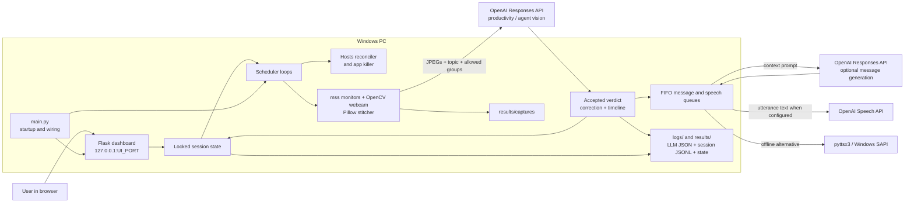

# Deep Work: Windows Productivity Enforcement

Deep Work is a personal Windows 11 focus app. During a session it can block
configured websites through the Windows hosts file, abruptly terminate named
distraction apps, capture all monitors plus camera index `0` when readable,
ask OpenAI vision models whether the visible work matches the stated task, and
speak feedback. A loopback-only Flask dashboard controls the session and shows
the current policy, timers, scheduler health, and accepted verdict history.


> [!CAUTION]
> This project handles highly sensitive screen, webcam, task, and model-output
> data. It also edits the hosts file and kills matching processes in its real
> mode. Read [Data, privacy, and cost](#data-privacy-and-cost) and begin with
> `--dry-hosts`. This is an enforcement aid, not a security boundary, and AI
> verdicts are not ground truth.

## Methodology and runtime flow

The operating loop is:

1. **Define intent:** enter one concrete work topic and explicitly allow only
   the website/app groups required for it.
2. **Enforce policy:** reconcile the desired website policy into one fenced
   hosts-file section and repeatedly kill unallowed configured app processes.
3. **Observe:** at a fixed delay, capture each physical monitor and optionally
   the default webcam; resize, label, vertically stitch, and save the panels as
   a JPEG.
4. **Evaluate evidence:** send the current stitched capture and the retained
   same-context rolling window to OpenAI. Capture one judges current alignment;
   capture two onward can compare visible task-relevant change over time.
5. **Respond and audit:** record the accepted verdict, append its session event,
   show it in the dashboard, and queue spoken feedback. The latest verdict can
   be corrected without erasing the original model label.
6. **Change context deliberately:** task access, temporary goal access, breaks,
   session replacement, and agentic mode update enforcement and invalidate
   incompatible rolling comparison context.

The app does not train or fine-tune a model. Its methodology is runtime
observation plus prompted inference over a short rolling image history. The
main evidence is the visible task state; timestamps, cursor motion, video
frames, or posture changes alone are not treated as progress. The full
evaluation contract and its static-work cases are in
[the user guide](docs/user-guide.md).

### Architecture and data flow



All application modules are under `deepwork/`; `main.py` remains the
phase-oriented composition wrapper. See [Architecture](docs/architecture.md)
for module ownership, threads, locks, and transition details.

## Install and set up

### Requirements

- Windows 11. Hosts editing, UAC relaunch, DirectShow camera capture, process
  policy, and audio playback are Windows-specific.
- [Git for Windows](https://git-scm.com/install/windows).
- [uv](https://docs.astral.sh/uv/getting-started/installation/) on `PATH`.
  The checked-in `.python-version` selects Python 3.13; uv can install that
  interpreter and creates the repository-local `.venv`.
- Internet access and an
  [OpenAI API key](https://platform.openai.com/api-keys) with access and API
  billing for the configured models. ChatGPT subscriptions and API billing are
  [managed separately](https://help.openai.com/en/articles/9039756).
- Administrator approval only for real hosts-file enforcement.
- A webcam is optional: an unsuccessful read omits its panel. Audio is optional
  for enforcement, although speech failures are logged.

If Git or uv is missing, install them in PowerShell and open a new terminal:

```powershell
winget install --id Git.Git -e --source winget
winget install --id astral-sh.uv -e --source winget
git --version
uv --version
```

### Reproduce the environment

Run these commands from the directory in which you want the checkout:

```powershell
git clone https://github.com/BurnyCoder/deep-work-jarvis-waifu-supervisor.git deep-work
Set-Location deep-work
uv sync --locked
Copy-Item .env.example .env
notepad .env
```

Replace `sk-your-key-here` in `.env` with the API key. Do not quote it,
commit it, or paste it into logs. For offline speech playback, also change
`TTS_ENGINE=pyttsx3`; vision and text generation still use OpenAI.

`uv sync --locked` verifies the checked-in lockfile and installs its exact
resolution into `./.venv`. Run from the repository root because
`projects.json`, `logs/`, and `results/` are current-directory-relative.
Existing process environment variables override matching `.env` values.

Check the local setup without using admin rights, capture hardware, or OpenAI:

```powershell
uv lock --check
uv run python main.py --help
uv run pytest
```

## Run and use the app

Choose a command with its side effects in mind:

| Command | What it runs | Important side effects |
|---|---|---|
| `uv run python main.py --dry-hosts --open-browser` | Dashboard and all scheduler loops; opens one browser tab after readiness | No UAC or hosts writes, **but after Start it can kill apps, capture/upload images, call APIs, write artifacts, and speak** |
| `uv run python main.py --dry-hosts` | Same dry-hosts application; open the logged URL yourself | Same non-host side effects as above |
| `uv run python main.py --smoke` | One direct `smoke test` capture → productivity analysis → possible speech attempt | Uses real capture/OpenAI/audio and writes artifacts; no Flask, scheduler threads, hosts writes, app killing, agent watch, start event, or good-luck message |
| `uv run python main.py` | Full dashboard and enforcement | Requests UAC, writes the hosts file, kills configured apps, captures/uploads, calls APIs, stores, and speaks |
| `Start Deep Work.bat` | Self-elevating launcher for the full command with `--open-browser` | Same effects as the full run |

`--open-browser` is opt-in for terminal runs. Otherwise, open the
`control panel listening:` URL printed in the terminal. The dashboard is
served by Werkzeug only on `127.0.0.1`; it has no authentication or CSRF
protection and must not be exposed as a production or network service.

### A session from start to finish

1. Start with `uv run python main.py --dry-hosts --open-browser`. This is a
   hosts-write rehearsal, not a general no-side-effects mode.
2. Enter a specific topic, select only required access groups, optionally select
   a saved project preset, and choose **Start session**.
3. Watch the status cards. Scheduler intervals are fixed delays after a tick
   finishes, and starting a session does not restart their countdowns.
4. Use temporary goal access for one concrete blocked subgoal. One grant may be
   active at a time; it can last 1–240 wall-clock minutes or until session end.
   It does not pause monitoring or spend social-break allowance.
5. Start an away or social-media break when needed. A break pauses productivity
   monitoring. Task access stays active; active goal access is suspended while
   its timer continues.
6. If the newest verdict is wrong, correct it on its history card. Only the
   latest current-session verdict is editable; the model label remains in the
   audit record and only a genuine label change adds a correction event/message.
7. To turn enforcement off, enter the exact case-sensitive phrase
   `I will not stop cool deepwork session`. For process exit, use Ctrl+C and
   allow normal cleanup to finish.

The canonical access catalog contains 14 groups:

- **Web only:** Reddit, YouTube, X / Twitter, Hacker News, LinkedIn, Bluesky,
  Substack, Facebook, LessWrong, EA Forum, and 4chan.
- **Web + app:** Discord opens its configured domains and spares
  `discord.exe`.
- **App only:** Telegram and Steam spare their configured exact process names.

Hosts policy enumerates explicit domains; it is not wildcard filtering. App
policy kills case-insensitive exact process-name matches abruptly, without
checking executable path or owner. See [Using Deep Work](docs/user-guide.md)
for ON/OFF/BREAK behavior, allowance accounting, goal access, agentic mode,
verdict corrections, and known input limitations.

### Dashboard

The dashboard polls the no-cache `/status` endpoint every three seconds while
the tab is visible and keeps the last good view through temporary failures.

## Configuration

The committed `.env.example` is the copyable source of defaults:

| Variable | Default | Purpose |
|---|---:|---|
| `OPENAI_API_KEY` | none | Required API credential |
| `VISION_MODEL` | `gpt-5.6-luna` | Productivity vision model; must support `detail="original"` |
| `PROGRESS_REASONING_EFFORT` | `medium` | Productivity response reasoning effort |
| `AGENT_VISION_MODEL` | `gpt-5.6-luna` | Agent-activity vision model |
| `AGENT_REASONING_EFFORT` | `medium` | Agent-activity reasoning effort |
| `TEXT_MODEL` | `gpt-5.6-luna` | Feedback-message model |
| `TEXT_REASONING_EFFORT` | `medium` | Feedback-message reasoning effort |
| `TTS_ENGINE` | `openai` | Exact `openai` selects OpenAI speech; every other value currently falls back to pyttsx3 |
| `TTS_MODEL` | `gpt-4o-mini-tts` | OpenAI speech model |
| `TTS_VOICE` | `coral` | OpenAI speech voice |
| `CAPTURE_INTERVAL_S` | `300` | Fixed delay between completed productivity ticks |
| `PROGRESS_WINDOW_CAPTURES` | `5` | Maximum retained same-context captures; minimum 2, comparison starts at capture 2 |
| `KILL_INTERVAL_S` | `3` | Fixed delay between enforcement ticks |
| `AGENT_CHECK_INTERVAL_S` | `60` | Fixed delay between eligible agent-watch ticks |
| `DAILY_SOCIAL_CAP_MIN` | `120` | Local-date social-break reservation cap |
| `UI_PORT` | `5000` | Loopback dashboard port |

`BATCH_SIZE` is accepted only as a compatibility fallback when
`PROGRESS_WINDOW_CAPTURES` is absent. Numeric validation is sparse: use
integers, keep scheduler delays positive, keep the progress window at least 2,
use a nonnegative allowance, and choose a valid TCP port. Nonpositive delays
can cause tight loops and excessive API/CPU usage.

Productivity requests use `detail="original"`. OpenAI documents that this
detail level preserves supplied image dimensions for the configured GPT-5.6
variants within the model's sizing limits. Here, each source tile was already
resized to 960 pixels wide and the composite was JPEG-compressed, so it is not
native monitor resolution. Verify any `VISION_MODEL` override against the
current [vision input guide](https://developers.openai.com/api/docs/guides/images-vision#choose-an-image-detail-level).
Agent-watch requests use low detail.

### Optional project presets

Create `projects.json` in the repository root to add reusable access groups:

```json
{
  "Documentation": ["youtube", "substack"],
  "Community support": ["discord", "telegram"]
}
```

The file is loaded once at startup. Names must be nonempty and values must be
arrays containing only canonical group keys. A selected preset is unioned with
the checked one-off groups. `projects.json` is **not gitignored**, so do not
put confidential project names in it unless you intend to track them.

## What the project stores

| Path | Contents |
|---|---|
| `logs/deepwork_YYYYMMDD_HHMMSS.log` | Timestamped runtime log; complete textual LLM prompts and semantic outputs also appear uncut in the terminal |
| `results/captures/*.jpg` | Timestamped quality-80 stitched monitor/webcam composites |
| `results/llm/*.json` | Successful text, productivity-vision, and agent-watch request/response records; vision records reference local capture paths instead of duplicating base64 |
| `results/sessions/YYYYMMDD.jsonl` | Append-only session, policy, break, agent, verdict, and correction events |
| `results/state.json` | Persisted allowance usage and topic history |

Live sessions, grants, verdict timelines, and scheduler state do not reload
after restart. Files are unencrypted, have no automatic rotation or pruning,
and can contain private data. `.env`, `logs/`, and `results/` are
gitignored; never force-add them.

## Data, privacy, and cost

- A productivity request uploads the current rolling set of one through
  `PROGRESS_WINDOW_CAPTURES` stitched JPEGs. Each can include every monitor and
  camera index `0`, plus the complete topic, permanent access groups, and any
  active goal-access goal/groups. Agent watching uploads one low-detail stitched
  JPEG per eligible check. Text-feedback requests upload their full context.
- `TTS_ENGINE=openai` uploads each queued utterance text to the Speech API,
  streams a temporary WAV, plays it, and deletes it after successful playback;
  an exception can leave that temp file. pyttsx3 keeps synthesis/playback local.
- The code does not pass `store=False` to Responses calls. OpenAI says API data
  is not used to train its models unless an organization opts in, but default
  Responses application state is retained for at least 30 days and default
  abuse-monitoring logs may be retained for up to 30 days. Review the current
  [OpenAI API data controls](https://developers.openai.com/api/docs/guides/your-data#storage-requirements-and-retention-controls-per-endpoint)
  for account controls, endpoint details, and exceptions.
- The application does not calculate cost. Rolling productivity requests resend
  retained images, agentic mode adds vision calls, some transitions/corrections
  add text calls, and OpenAI TTS adds speech calls. Check current model
  [pricing](https://developers.openai.com/api/docs/pricing) and your API usage.

See [Privacy, data, retention, and cost](docs/privacy-and-data.md) before using
real personal or employer data.

## Shutdown and recovery

Normal Disable from an active mode and registered shutdown after an active run
attempt serialized hosts cleanup. Cleanup is still best-effort: a hard kill,
power loss, or process crash can skip `atexit`; startup, Disable while already
OFF, and shutdown from an untouched OFF start do not proactively remove a stale
fence. Run only one instance because hosts and local state files have no
cross-process lock.

If a previous run left websites blocked:

1. Exit every Deep Work instance.
2. Open `C:\Windows\System32\drivers\etc\hosts` as Administrator.
3. Remove the section from `# >>> deepwork block start` through
   `# <<< deepwork block end`, inclusive. Preserve every other line.
4. Run `ipconfig /flushdns` in an elevated terminal.

Back up the file before editing. An unmatched start marker is especially
dangerous because a later apply/clear treats everything after it as owned
content. See [Troubleshooting](docs/troubleshooting.md) for startup, port,
hosts, resolver, capture, audio, OpenAI, and artifact failures.

## Verification

The repository's hardware/network/admin-free automated suite uses temporary
files, generated images, fake clients, Flask requests, and thread coordination:

```powershell
uv lock --check
uv run pytest
uv run python main.py --help
```

That suite is not proof that Windows hosts edits, UAC, the local devices, the
network, model access, or nondeterministic model judgments work on a particular
machine. `--smoke` is the shortest real capture/API/audio path, while the
interactive `--dry-hosts` run exercises the UI and loops without hosts writes.
Use the bounded, side-effect-labeled checks in
[Verification](docs/verification.md).

## Documentation map

| Document | Use it for |
|---|---|
| [Using Deep Work](docs/user-guide.md) | Modes, access groups and presets, goal access, breaks, agentic mode, dashboard/status, disable, and exit behavior |
| [Architecture](docs/architecture.md) | Modules, collaborators, threads, locks, transition ordering, and data flow |
| [Privacy and data](docs/privacy-and-data.md) | Exact uploads, local artifacts, retention, cost drivers, and handling guidance |
| [Startup](docs/startup.md) | Launcher, UAC relaunch, server binding, readiness, and browser-open sequence |
| [Troubleshooting](docs/troubleshooting.md) | Safe recovery and common runtime failures |
| [Verification](docs/verification.md) | Automated checks and opt-in manual/system checks |
| [Verdict corrections](docs/verdict-corrections.md) | Correction API, accounting semantics, audit order, and focused test contract |
| [Repository operating guide](AGENTS.md) | Code-sensitive invariants, ownership, implementation rules, and GitHub workflow |

The code is the behavioral source of truth. Documentation claims in this
repository are intended to describe the checked-in implementation, not a
planned feature.
