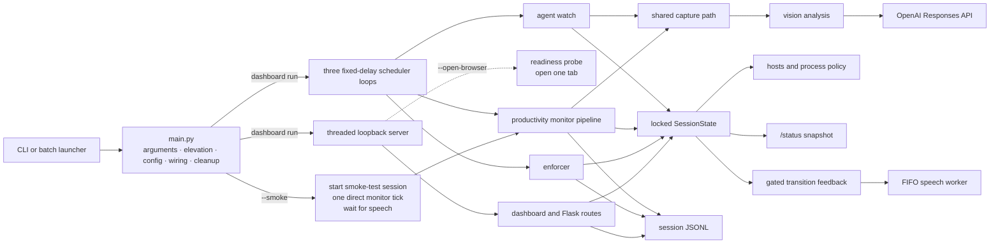

# Architecture and runtime design

This guide is the detailed technical map of the Deep Work runtime. Start with
the [README](../README.md) for installation and a short data-flow overview, then
use this document when changing orchestration, concurrency, enforcement,
monitoring, persistence, or dashboard status.

Operational behavior belongs in the [user guide](user-guide.md), data handling
and retention in [privacy and data](privacy-and-data.md), startup details in
[startup](startup.md), and recovery procedures in
[troubleshooting](troubleshooting.md). The manual and automated acceptance
matrix is in [verification](verification.md); correction-specific behavior is
in [verdict corrections](verdict-corrections.md).

## At a glance

`main.py` is deliberately a phase-oriented composition root. It selects a run
mode and wires collaborators; implementation lives under `deepwork/`.



The smoke branch uses the same capture, productivity analyzer, result storage,
and speech collaborators as a scheduled monitor tick. It does **not** start the
scheduler threads, Flask server, readiness worker, browser, enforcer, app
killer, or agent watcher. The registered shutdown handler still publishes OFF
through the dry-run blocker and saves reloadable state.

## Wrapper phases and process lifecycle

`main.py` performs these phases in order:

1. Parse `--smoke`, `--dry-hosts`, and `--open-browser`. `--help` exits from
   argument parsing before runtime collaborators are imported.
2. Request Windows elevation for a real-hosts dashboard run. Smoke and
   `--dry-hosts` skip elevation.
3. Load `.env` into an immutable `Config`, configure timestamped file and
   terminal logging, and require a non-empty API key.
4. Select `HostsBlocker` for real enforcement or `DryRunBlocker` for smoke and
   `--dry-hosts`.
5. Build `ResultsStore`, `SessionState`, one shared OpenAI client, analyzers,
   message and speech adapters, transition-feedback worker, `Scheduler`, and
   the Flask application. Only allowance usage and topic history are restored
   from `results/state.json`; `projects.json` is loaded and validated once here.
6. Register `shutdown_runtime()` with Python's
   [`atexit`](https://docs.python.org/3/library/atexit.html) machinery.
7. Run either the direct smoke tick or the long-lived scheduler and dashboard.

| Invocation shape | Blocker | Scheduler loops | HTTP server | Browser work |
|---|---|---:|---:|---:|
| `--smoke` | dry-run | no | no | no, even with `--open-browser` |
| `--dry-hosts` | dry-run | yes | yes | only with `--open-browser` |
| default | Windows hosts file | yes | yes | only with `--open-browser` |
| `Start Deep Work.bat` | Windows hosts file | yes | yes | yes; the launcher passes `--open-browser` |

For a dashboard run, `scheduler.start()` runs before `serve_dashboard()`. The
server factory then binds `127.0.0.1:UI_PORT` before any optional readiness
worker starts. That worker treats any completed `/status` HTTP response as
reachable and attempts one default-browser tab. The server path and its failure
semantics are covered in [startup](startup.md).

Normal shutdown stops scheduler producers, enters terminal OFF state, attempts
to record an active grant's end when applicable, attempts to reconcile the
newest OFF policy, retries retained JSONL lines, releases feedback whose gates
are satisfied, saves reloadable state, and performs bounded worker cleanup.
Individual cleanup failures are logged. `atexit` is not a hard-termination
guarantee; see [troubleshooting](troubleshooting.md) for the manual hosts
cleanup path.

## Full runtime flow

```mermaid
flowchart TD
    subgraph Composition["Composition and serving"]
        Main["main.py"] --> Access["access_policy.py<br/>catalog · validation · projections · presets"]
        Main --> State["SessionState"]
        Main --> Store["ResultsStore"]
        Main --> Flask["Flask app"]
        Main --> TransitionWorker["transition-feedback worker"]
        Main --> SpeechQueue["speech worker"]
        Main --> RunMode{"run mode"}
        RunMode -- "--smoke" --> SmokeRun["start smoke-test session<br/>direct one monitor tick"]
        RunMode -- "dashboard" --> Scheduler["Scheduler<br/>start fixed-delay loops"]
        RunMode -- "dashboard" --> Server["webui/server.py<br/>bind · serve · optional readiness/open"]
    end

    subgraph Control["Concurrent control plane"]
        Browser["dashboard browser"]
        Server -->|"serve requests"| Flask
        Server -. "readiness response then open" .-> Browser
        Browser -->|"POST actions"| Flask
        Browser -->|"GET /status"| Flask
        Flask -->|"compose status response"| StatusBuilder["status payload builder"]
        Flask -->|"strict allowed_groups parsing"| Access
        Flask -->|"state transition"| Life["lifecycle coordinator"]
        Life --> State
        Life -->|"append canonical event"| EventBuffer["ordered JSONL buffer"]
        Life -->|"publish newest desired hosts policy"| Reconcile["state-owned reconciliation"]
        Life -->|"queue immutable context"| Gates["policy and durability gates"]
    end

    subgraph Background["Fixed-delay background loops"]
        Scheduler --> Enforcer["enforcer tick"]
        Scheduler --> Monitor["monitor tick"]
        Scheduler --> AgentWatch["agent-watch tick"]
        SmokeRun --> Monitor
        Enforcer -->|"expiry · kill snapshot · policy retry"| Life
    end

    subgraph CaptureAndInference["Capture and inference"]
        Monitor -->|"only while monitoring active"| Context["immutable monitoring context"]
        Context --> CaptureLock["shared capture lock"]
        AgentWatch --> CaptureLock
        CaptureLock --> Capture["all monitors + optional webcam<br/>labeled 960 px-wide vertical tiles"]
        Capture -->|"monitor caller"| CaptureGate{"same active context<br/>after capture?"}
        CaptureGate -- no --> EarlyStale["context_changed<br/>no file or API call"]
        CaptureGate -- yes --> MonitorSave["save quality-80 JPEG"]
        MonitorSave --> Store
        MonitorSave --> Analyzer["rolling productivity analyzer<br/>capture 1 alignment · capture 2+ comparison"]
        Analyzer -->|"original-detail structured request"| ProductivityResponses["OpenAI Responses API<br/>productivity vision"]
        Capture -->|"agent-watch caller"| AgentSave["save quality-80 JPEG"]
        AgentSave --> Store
        AgentSave --> AgentAnalyzer["single-capture activity checker"]
        AgentAnalyzer -->|"low-detail structured request"| AgentResponses["OpenAI Responses API<br/>agent activity"]
        ProductivityResponses -->|"successful exchange"| Store
        AgentResponses -->|"successful exchange"| Store
        ProductivityResponses --> ContextGate{"same active context<br/>after analysis?"}
        ContextGate -- yes -->|"record verdict and source event"| Life
        ContextGate -- no --> Stale["context_changed<br/>no verdict/event/speech"]
        AgentResponses -->|"no post-inference context gate"| Life
    end

    subgraph Enforcement["Enforcement backends"]
        State -->|"effective blocklist"| Reconcile
        Reconcile -->|"apply or clear"| Hosts["HostsBlocker or DryRunBlocker"]
        State -->|"effective process targets"| Killer["exact-name psutil kill sweep"]
        Enforcer --> Killer
        Reconcile -->|"successful matching revision"| Gates
    end

    subgraph DurabilityAndFeedback["Durability and feedback"]
        EventBuffer --> Sessions["results/sessions/YYYYMMDD.jsonl"]
        Sessions -->|"all earlier lines durable"| Gates
        Gates --> Ready["ready FIFO"]
        Ready --> TransitionWorker
        TransitionWorker -->|"text generation"| TextResponses["OpenAI Responses API<br/>transition feedback text"]
        TextResponses -->|"successful exchange"| Store
        TextResponses --> SpeechQueue
        Monitor -->|"ordinary reason after source event"| VerdictSpeechGate{"same latest verdict<br/>label + revision?"}
        Monitor -->|"nudge/milestone after source event"| MonitorText["OpenAI Responses API<br/>verdict feedback text"]
        MonitorText -->|"successful exchange"| Store
        MonitorText --> VerdictSpeechGate
        VerdictSpeechGate -- yes --> SpeechQueue
        VerdictSpeechGate -- no --> Suppressed["suppress stale utterance"]
        SpeechQueue --> TTS["OpenAI TTS or pyttsx3"]
    end

    subgraph Observability["Status and local observability"]
        State --> StatusBuilder
        Scheduler --> Runtime["RuntimeStatus"]
        Runtime --> StatusBuilder
        StatusBuilder --> Status["JSON-safe /status<br/>Cache-Control: no-store"]
        Store --> Results["captures · LLM exchanges · sessions · state"]
        Main --> Logs["timestamped log + terminal"]
    end
```

The productivity path's final context gate is the atomic
`record_verdict_if_context()` call. The agent-watch arrow deliberately has no
equivalent post-inference gate: it checks eligibility before capture, then may
publish a stale busy/idle transition if mode or session state changes during
its model call. That current limitation is covered by tests and must not be
silently described as having productivity's stronger guarantee.

## Module ownership

This is the canonical module-responsibility table. Update it when ownership
moves; other documents should link here instead of maintaining another copy.

| Module | Responsibility |
|---|---|
| `main.py` | Arguments, elevation, configuration/logging, blocker selection, collaborator wiring, cleanup registration, and smoke-versus-server selection |
| `deepwork/config.py` | Frozen `.env`-derived `Config`, hardcoded site/app policy tables, hostname expansion, and sparse numeric parsing |
| `deepwork/access_policy.py` | Immutable 14-group catalog, labels/capabilities, strict normalization, site/app projection, `projects.json` loading, and task/preset union |
| `deepwork/logging_setup.py` | Whole-second-named UTF-8 file logging plus real-time terminal logging |
| `deepwork/state.py` | Locked modes, terminal shutdown, grants, breaks, allowance, agent state, monitoring revisions, retryable policy reconciliation, corrected verdict accounting, feedback gates, and status snapshots |
| `deepwork/storage.py` | Quality-80 capture JPEGs, text/vision exchange JSON, retryable ordered session JSONL, and persisted allowance/topic state |
| `deepwork/runtime_status.py` | Locked JSON-safe fixed-delay cadence, phase, result, countdown, and error state |
| `deepwork/scheduler.py` | Enforcer, context-safe productivity monitor, agent watcher, fixed-delay daemon loops, and the shared capture lock |
| `deepwork/blocking/admin.py` | Windows administrator check and `runas` self-relaunch |
| `deepwork/blocking/hosts_blocker.py` | Marker-fenced hosts replacement/removal, best-effort DNS-cache flush, and the dry-run adapter |
| `deepwork/blocking/app_killer.py` | Abrupt case-insensitive exact process-name termination through psutil |
| `deepwork/monitoring/screen_capture.py` | One Pillow image per physical monitor through mss |
| `deepwork/monitoring/webcam_capture.py` | DirectShow camera-index-0 frame; an unsuccessful read returns `None`, while an exception fails that capture tick |
| `deepwork/monitoring/stitcher.py` | Labeled vertical composite after resizing each monitor/webcam tile to 960 pixels wide |
| `deepwork/monitoring/analyzer.py` | Original-detail rolling productivity verdicts and low-detail single-capture agent-activity verdicts |
| `deepwork/feedback/goal_access.py` | Policy/event-durability gates and the independent FIFO transition-message worker; the historical filename also covers non-goal transitions |
| `deepwork/feedback/messages.py` | Context-grounded good-luck, nudge, milestone, break, goal-access, verdict-correction, and agent-transition prompts |
| `deepwork/feedback/tts.py` | OpenAI temporary-WAV or per-utterance pyttsx3 adapters behind one FIFO daemon worker |
| `deepwork/webui/app.py` | Flask factory plus session, access, break, agent, latest-verdict correction, and disable routes |
| `deepwork/webui/status.py` | Composition of locked state and scheduler snapshots |
| `deepwork/webui/server.py` | Threaded loopback binding, readiness polling, optional one-tab browser opening, and server cleanup |
| `deepwork/webui/templates/` and `deepwork/webui/static/` | Dashboard rendering, shared access picker, safe text insertion, native form actions, and non-overlapping status polling |

## Scheduler cadence and tick ownership

The scheduler uses three ordinary daemon threads for blocking capture, model,
filesystem, and process work. Transition generation and audio each have their
own worker. Every scheduler loop follows the same shape, based on interruptible
[`threading.Event.wait()`](https://docs.python.org/3/library/threading.html#threading.Event.wait):

```text
wait interval -> mark running -> execute blocking tick -> record result/error
              -> wait the full interval again
```

This is a fixed **delay**, not a wall-clock schedule. A tick's own duration is
added to the interval between tick starts, and starting a session does not
reset a loop countdown. Enabled loops wait once before their first tick.
`stop()` sets the shared event, waking all waits immediately, then joins each
thread for at most five seconds.

`RuntimeStatus` independently records whether the scheduler is running and, for
each loop, whether it is disabled, stopped, waiting, or running. It also stores
timestamps, the next-due countdown, the last returned result, and an uncaught
tick error. Many expected failures are caught inside a tick and returned as a
result such as `capture_failed` or `enforcement_failed`; those appear in
`last_result`, not `last_error`.

The loop responsibilities are intentionally different:

- **Enforcer:** under the lifecycle coordinator, retry session JSONL, expire a
  due break and goal grant, derive and kill current process targets, retry the
  newest dirty hosts policy, and advance eligible transition feedback through
  its gates. Expiry is observed on the first later enforcer tick, not at an
  exact wall-clock deadline.
- **Monitor:** pause outside eligible ON state; capture, save, and analyze one
  context-safe rolling window; atomically record one accepted verdict and
  append its source event; then, if that append succeeds, enqueue one ordinary
  reason or generated nudge/praise if a correction has not superseded it.
- **Agent watch:** while ON and agentic mode is enabled, capture and classify
  whether a visible coding agent is busy, then reconcile and announce only
  busy/idle transitions. A steady verdict still reaches reconciliation so a
  previous backend failure can be retried.

## Monitoring context and capture concurrency

The monitor takes an immutable `MonitoringContext` containing a monotonic
revision, session identity, topic, permanent task/preset groups, and active
goal-grant identity, goal, and groups. Any relevant session or policy
transition advances the revision. Restoring the same visible values after an
intervening transition therefore still creates a different identity.

When the scheduler sees a new context before capture, it clears the analyzer's
bounded [`deque`](https://docs.python.org/3/library/collections.html#collections.deque).
The monitor then checks context at two safety boundaries:

1. After capture, before saving or calling a model. A transition during native
   capture returns `context_changed` without a capture file or API call.
2. After analysis, during atomic verdict acceptance. A transition during save
   or model work may leave a local capture and successful LLM exchange, but it
   produces no verdict state, source event, or speech.

The saved capture is appended to the analyzer window before the vision request.
Consequently, a failed model call leaves that capture available for a later
same-context comparison. Capture one judges only current task alignment;
capture two and later send the whole available oldest-to-newest window up to
`PROGRESS_WINDOW_CAPTURES`. The implementation uses the OpenAI Responses API's
[multiple-image input](https://developers.openai.com/api/docs/guides/images-vision#giving-a-model-images-as-input)
and [structured outputs](https://developers.openai.com/api/docs/guides/structured-outputs).

The productivity and agent-watch loops share one primitive capture lock. A
lock acquisition blocks the second caller until the first exits, as specified
by Python's [`Lock`](https://docs.python.org/3/library/threading.html#lock-objects).
The protected region is only the injected capture callable: monitor screenshots,
the webcam attempt, and image stitching. JPEG writes, model requests, state
mutation, feedback generation, and speech remain outside it, so slow inference
does not monopolize the camera path.

## Locking and concurrency boundaries

The threaded server, three scheduler threads, transition worker, and speech
worker share one process. Their lock scopes are deliberately narrow and have
different ownership:

| Boundary | Protects | Deliberately excludes |
|---|---|---|
| `SessionState._lock` | Mutable domain state, monitoring revision, feedback lists, status snapshots, and the complete hosts reconciliation call | Model calls, speech, and ordinary capture |
| Lifecycle coordinator | Cross-collaborator order for transitions, expiry/kill/reconciliation, verdict publication/corrections, and shutdown | Optional message/TTS delivery |
| Feedback-delivery lock | Claiming and delivering ready transition requests in FIFO order | Policy mutation and reconciliation |
| Scheduler capture lock | One complete injected screen/webcam capture | Persistence, inference, state changes, and speech |
| ResultsStore session-event lock | JSONL append order, rollback, and in-memory retry queue | Captures, LLM exchanges, and `state.json` |
| HostsBlocker lock | One direct hosts read-modify-write and DNS-flush sequence | State computation and app killing |
| RuntimeStatus lock | Loop telemetry snapshots | Scheduler tick work |
| Queue objects | Transition-worker wakeups and process-wide speech order | State/event/policy correctness, which is enforced before enqueue |

The lifecycle coordinator remains held through the enforcer's process sweep.
That prevents a route from granting an app after the enforcer selects targets
but before it kills them. It also remains held through a source-verdict JSONL
append, preventing a correction from overtaking its originating event.

## Enforcement reconciliation

`SessionState` owns desired policy. Each monitoring/policy transition routed
through `_mark_policy_changed()` compares the prior and new hosts-policy
signatures, increments the monitoring revision, and marks hosts enforcement
dirty only if the concrete `apply(domains)` or `clear()` operation changed. An
app-only permission change still resets monitoring context and process targets,
but does not rewrite an identical hosts section or flush DNS.

`reconcile_enforcement()` holds the state lock while it computes and publishes
the latest desired hosts action. This serialization prevents an older writer
from landing after a newer transition. A successful call clears the dirty bit;
an exception propagates while leaving it set. A mutating Flask route that
requires reconciliation returns 503 after committing the state change, while
the next enforcer tick keeps retrying.
`/status.enforcement.reconciliation_pending` exposes that desired/applied gap.

The hosts backend and process backend are related but distinct:

- `HostsBlocker` directly replaces its marker-fenced section with the current
  explicit domain tuple, or removes the section for OFF. `DryRunBlocker` keeps
  the same interface and logs instead of writing.
- The enforcer derives exact executable targets from the same canonical access
  groups on every active tick and asks `psutil` to kill matching processes.
  This sweep is not represented by the hosts dirty bit. Agent-busy mode empties
  the website blocklist but does not add app permissions.

Backend limitations and recovery are intentionally kept in
[troubleshooting](troubleshooting.md), not duplicated here.

## Session-event durability and feedback queues

Every session event is converted to one complete timestamped JSON line and
added to an in-memory FIFO before append. `ResultsStore` serializes Flask and
scheduler writers. If write, flush, or close fails after writing bytes, it
truncates back to the previous line boundary and retains the complete line for
the next event append, reconciling route, enforcer tick, or shutdown retry.
This follows the
[JSON Lines](https://jsonlines.org/) one-object-per-line format.

Transition feedback has two independent gates:

1. **Policy gate:** permission-bearing acknowledgments wait until a successful
   reconciliation supports their exact policy revision. Superseded requests
   are discarded rather than claiming access that never applied. Goal starts
   can remain pending while a break suspends them; goal ends can be approved by
   a later policy that still makes the ending statement true. Correction
   acknowledgments skip this gate because they make no enforcement claim.
2. **Durability gate:** approved requests move to the ready queue only when no
   earlier JSONL line remains pending.

FIFO order applies to the **ready** queue. A later independent acknowledgment
can overtake a goal request that has not cleared its policy gate, including one
whose earlier JSONL line also needed a durability retry. Once ready, one
transition worker claims each request before its optional model call and
submits the result to the process-wide speech queue. Model or TTS failure is
logged and does not roll back state, events, or enforcement, nor does it retry
an already claimed request.

Ordinary productivity speech joins the same speech queue but bypasses the
transition worker: a normal productive verdict uses its vision-generated
reason; off-track and milestone outcomes first use `MessageGenerator`. Before
enqueue, the monitor rechecks verdict identity, effective label, and correction
revision under the lifecycle coordinator so an accepted correction suppresses
stale original speech.

## Storage and status surfaces

`ResultsStore` creates its tree during object construction. The storage paths
and reload behavior are:

| Path | Writer | Reloaded into live state? |
|---|---|---:|
| `results/captures/*.jpg` | Productivity and agent-watch ticks that reach their save step | no |
| `results/llm/*.json` | Successful productivity-vision, agent-watch-vision, and text-feedback Responses calls | no |
| `results/sessions/YYYYMMDD.jsonl` | Flask routes and scheduler/shutdown transitions | no |
| `results/state.json` | Routes and shutdown | only daily social usage and prior topics |
| `logs/deepwork_*.log` | Root logging configuration | no |

Only session JSONL has ordered in-memory retry and partial-write rollback.
Capture, LLM exchange, and state writes are direct. The exact contents,
external API boundaries, retention, and cleanup responsibilities are defined in
[privacy and data](privacy-and-data.md).

`GET /status` takes one locked state snapshot, adds `server_time`, and merges a
separate locked `RuntimeStatus` snapshot. It returns JSON-safe copies and
`Cache-Control: no-store`. The state side includes session/mode information,
effective task access, break and grant state, verdict history, monitoring
eligibility, and **desired** enforcement counts plus the reconciliation flag.
The runtime side includes the three loop records described above. The browser
matches a monitor runtime result to the effective latest verdict by immutable
`verdict_id`, so a correction changes the displayed label without inventing a
new scheduler run.

For behavior changes, verify both the owning subsystem and this composition
boundary using the commands and scenarios in [verification](verification.md).
